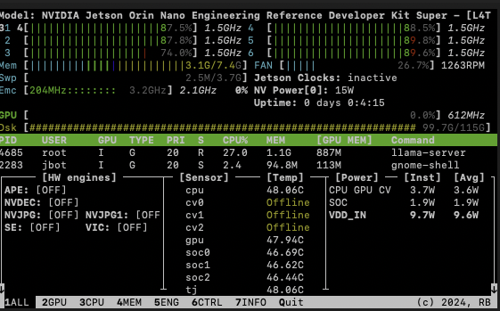

# Running Gemma 4 on Jetson Orin Nano (8GB) — Constraints & Optimization

## 🎯 Goal
Run a modern LLM (Gemma 4) on constrained edge hardware (Jetson Orin Nano 8GB) with stable performance and no cloud dependencies.

## ⚙️ Setup

See scripts/run-gemma4.sh

## 🧠 Key Learnings
- CUDA OOM issues require tuning -ngl
- Context size directly impacts RAM usage
- Docker must use persistent volumes to avoid re-downloads
- llama.cpp works better than Ollama on Jetson

## 🚀 Result
- Model: Gemma 4 E2B Q4_K_S

- Context: 4096 tokens

- GPU offload: 1 layer

- Device: Jetson Orin Nano 8GB

- Access: Browser + OpenAI-compatible API

## 📊 Monitoring (jtop)

Below is the system running Gemma 4 locally on the Jetson Orin Nano:

## 🧩 Architecture

Mac client
   ↓
Jetson Orin Nano
   ↓
Docker + llama.cpp
   ↓
Gemma 4 GGUF
   ↓
HTTP API on port 8080

## 🚀 How to Run

chmod +x scripts/run-gemma4.sh

./scripts/run-gemma4.sh
